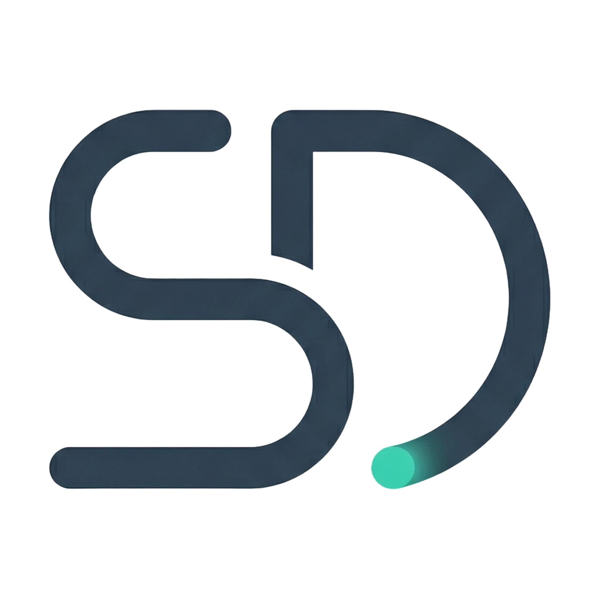

<p align="center">
  
</p>

# Selasar Digital - Corporate Website & Admin Portal

This repository contains the source code for the brand new **Selasar Digital** corporate website, encompassing a modern landing page, dynamic portfolio gallery, and a custom Content Management System (CMS) backend built on **Laravel 12**.

## 🚀 Features

*   **Modern Frontend Design**: Built with **Tailwind CSS v4** and **Alpine.js**, providing a sleek, responsive, and interactive user experience with glassmorphism and subtle micro-animations.
*   **Dynamic CMS**: A fully functional custom dashboard using Laravel Breeze for authentication.
    *   **Portfolio Management**: Complete CRUD capabilities for managing case studies, technologies, and client testimonials.
    *   **Services Management**: Easily update the service offerings displayed on the website.
    *   **Inquiries Dashboard**: Keep track of user messages submitted from the public "Contact Us" form.
*   **SEO Optimized**: Dynamic metadata and OpenGraph tags specifically configured for high visibility on search engines and social media platforms.
*   **Production Ready**: Integrated with **Vite** for lightning-fast hot module replacement during development and aggressive asset minification for production.

## 🛠️ Tech Stack

*   **Framework**: [Laravel 12](https://laravel.com/) (PHP)
*   **Frontend Tools**: [Vite](https://vitejs.dev/)
*   **Styling**: [Tailwind CSS v4](https://tailwindcss.com/)
*   **Interactivity**: [Alpine.js](https://alpinejs.dev/)
*   **Database**: MySQL / SQLite (configurable via `.env`)

## 💻 Getting Started (Local Development)

To get a local copy up and running, follow these simple steps.

### Prerequisites
*   PHP >= 8.2
*   Composer
*   Node.js (LTS version) & NPM
*   A local database server (MySQL / MariaDB / PostgreSQL)

### Installation

1.  **Clone the repository**
    ```bash
    git clone https://github.com/afebrii/selasar-digital.git
    cd selasar-digital
    ```

2.  **Install PHP dependencies**
    ```bash
    composer install
    ```

3.  **Install Frontend dependencies**
    ```bash
    npm install
    ```

4.  **Set up your environment file**
    Copy the sample `.env.example` file and rename it to `.env`.
    ```bash
    cp .env.example .env
    ```
    Generate the application key:
    ```bash
    php artisan key:generate
    ```

5.  **Configure the Database**
    Open your `.env` file and set your database connection details (`DB_DATABASE`, `DB_USERNAME`, `DB_PASSWORD`).

6.  **Run Migrations and Seeders**
    This will set up the database structure and populate it with initial data (like the Admin user, Services, and default Categories).
    ```bash
    php artisan migrate --seed
    ```
    *Note: The default admin credentials can be found or changed strictly in the `DatabaseSeeder`.*

7.  **Link Storage**
    Create a symbolic link to ensure uploaded images (like portfolio covers) are publicly accessible.
    ```bash
    php artisan storage:link
    ```

8.  **Run the application**
    You need to run two processes simultaneously in separate terminal windows.
    
    *Start the Laravel development server:*
    ```bash
    php artisan serve
    ```
    *Start the Vite development server (for compiling CSS/JS):*
    ```bash
    npm run dev
    ```

9.  **Access the site**
    Open your browser and visit: `http://localhost:8000`
    You can access the admin dashboard at `http://localhost:8000/login`.

## 📦 Deployment (Production Build)

When deploying to a production environment, ensure you compile the frontend assets optimally:

```bash
npm run build
```

This will run Vite in production mode, compiling and minifying all stylesheets and JavaScript files into the `public/build` directory. Ensure your `.env` file on the production server has `APP_ENV=production` and `APP_DEBUG=false`.

---
<p align="center">
  <i>Crafted with ❤️ by Selasar Digital</i>
</p>
